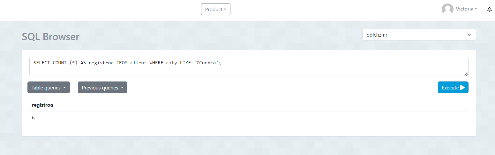
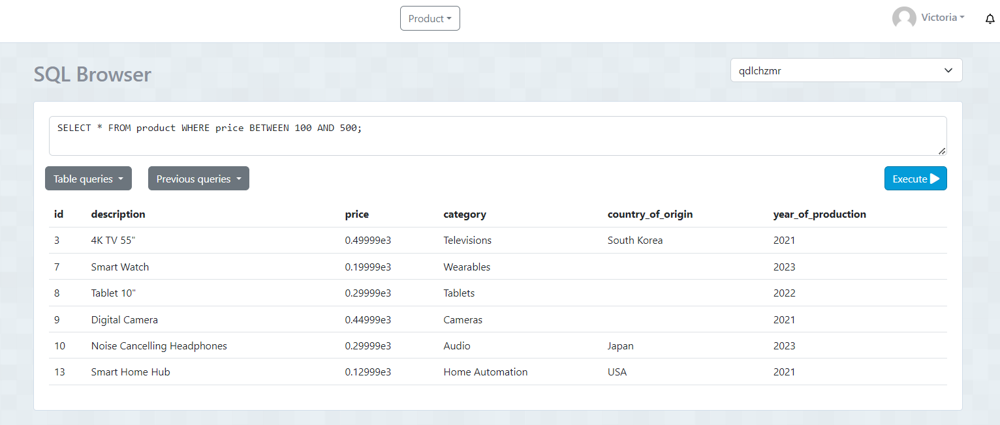

1. Contar el número de productos de una categoría específica.
SENTENCIA: SELECT COUNT (*) AS stock FROM product 
CAPTURA

2. Contar el número de clientes en una ciudad específica.

SENTENCIA: SELECT COUNT (*) AS registroa FROM client WHERE city LIKE '%Cuenca';
CAPTURA

3. Contar el número de productos cuyo precio está dentro de un rango específico 

SENTENCIA: SELECT COUNT (*) AS precio_rango FROM product WHERE price >0.7 AND < 0.9;  
CAPTURA

4. Seleccionar clientes que viven en una ciudad específica(PAUTE) y tienen un tipo de cliente específico(VIP)

SENTENCIA SELECT * FROM client WHERE city = 'Paute' AND type_of_client = 'VIP'
CAPTURA

5. Seleccionar productos que pertenecen a una categoría específica (anio) y cuyo precio está por encima de un valor específico (>2)

SENTENCIA:  SELECT * FROM product WHERE year_of_production = 2023 AND price >0.2
CAPTURA

6. Seleccionar productos que fueron producidos en un año específico(2023) y en un país de origen específico(China)

SENTENCIA:  SELECT * FROM product WHERE year_of_production = 2023 AND country_of_origin = 'China'
CAPTURA

7. Seleccionar clientes cuyo nombre completo comience con 'J'. 

SENTENCIA: SELECT * FROM client WHERE fullname LIKE 'J%'
CAPTURA

8. Seleccionar clientes cuya ciudad contenga la letra 'a'
 
SENTENCIA: SELECT * FROM client WHERE fullname LIKE '%a'
CAPTURA
